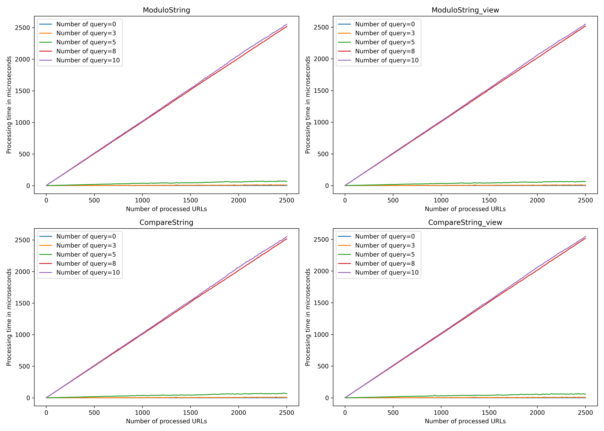
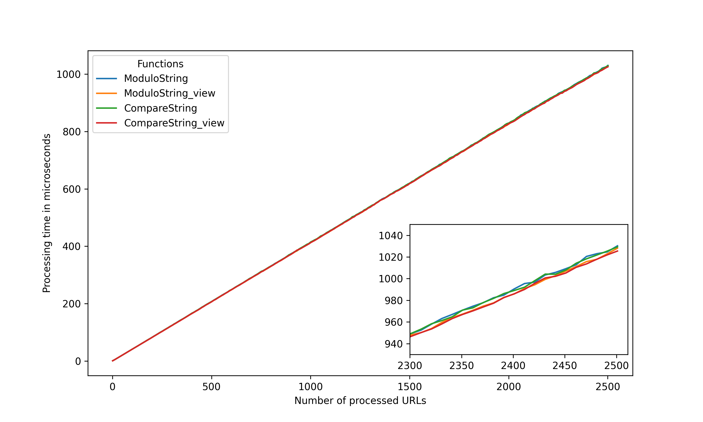

# Test of different url parser approaches

The program is designed to compare the use of `std::string`, `std::string_view`, modulo operation and multiple value comparison with the expectation that the condition will not be satisfied.

The current version is for linux only. To implement on windows you need to change the command on line 153

Since these are functions that are executed quickly, other system activities are reflected in the test, so more measurements must be taken to eliminate this. The value `repeat_test` is used to indicate the number of iterations of the whole test.

## Variables affecting the range of the test

 - `repeat_test` - Number of repetitions of the whole test
 - `num_urls_list` - Range of the number of urls to be processed
 - `query_counts` - Range of queries that will be contained in the URL

## Results
```
Hardware: Intel i7-8750H
repeat_test = 1000
num_urls_list = { x ∈ N ∣ x = 1 + 10n , 0 ≤ n ≤ 2501 }
query_counts = {0, 3, 5, 8, 10}
```


